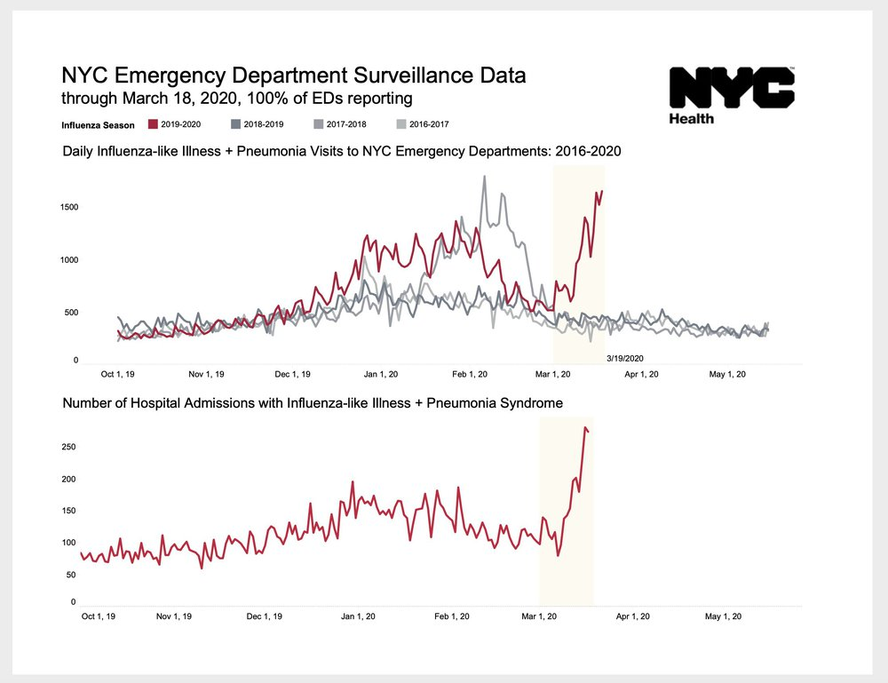
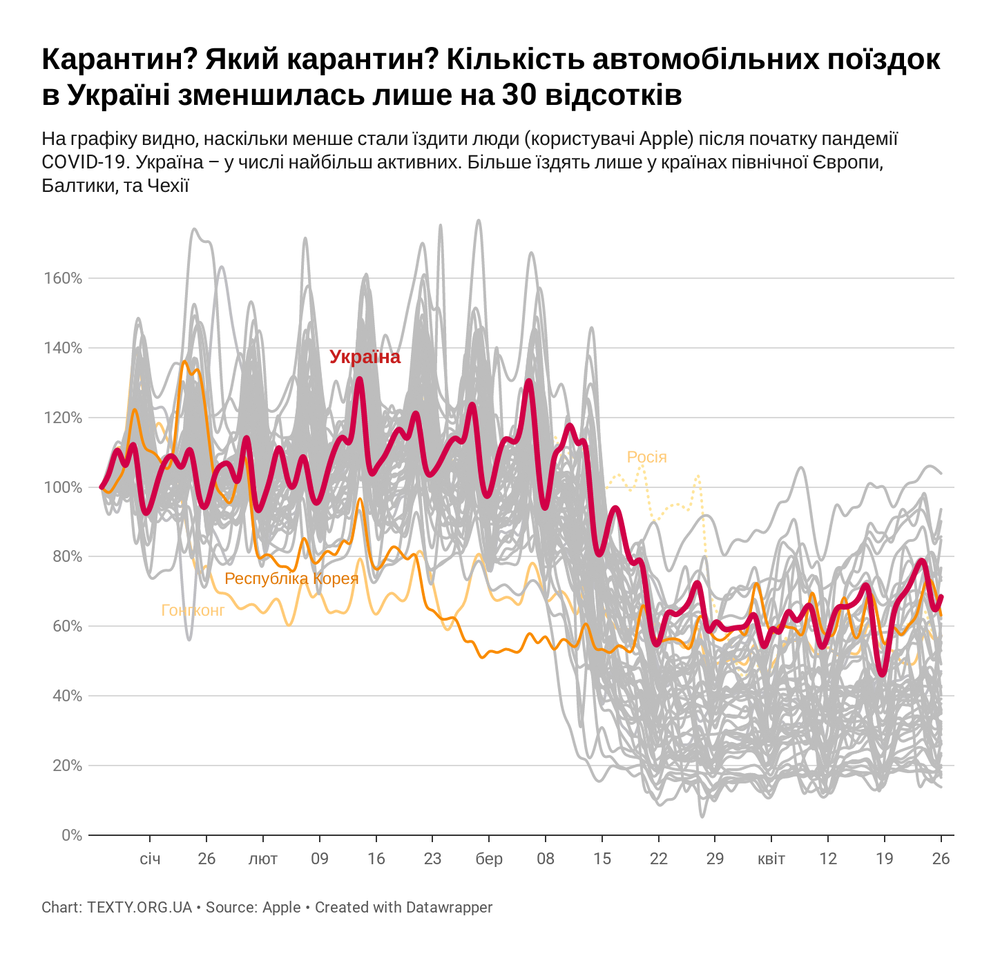

### Наші проєкти по COVID-19
- [Моніторинг Rt в областях](https://texty.org.ua/projects/101219/epidemiya-covid-19-v-oblastyah/)
- [Відносне становище у світі](https://texty.org.ua/d/2020/covid-19/)

### Яку статистику брати для моніторингу ситуації
- кількість нових випадків (версія МОЗ? версія НСЗУ? версія ЦГЗ?)
- Rt, [особливості в областях](https://texty.org.ua/fragments/101391/u-poshyrenni-koronavirusu-kozhen-rehion-maye-svij-osoblyvyj-styl/)
- смертність

### Тестування
- одна із проблем з кількістю випадків - це те, що вони залежать від кількості тестувань. Де отримати [дані по тестуванням](https://cloud.phc.org.ua/index.php/s/gk98W4s3DZFbwEd)? 
- завдяки [археологічним розкопкам даних](https://texty.org.ua/fragments/101328/u-yakyh-oblastyah-testuyut-na-covid-19-najpovilnishe/), ми можемо оцінити як швидко результати тестів потрапляють у загальну статистику

### Медична статистика
- [Грип-моніторинг](https://phc.org.ua/kontrol-zakhvoryuvan/inshi-infekciyni-zakhvoryuvannya/monitoring-i-ocinka/zakhvoryuvanist-na-grip-ta-grvi-v-ukraini) - не вистачає оперативних даних зверненням людей із симптомами грипу, кількість всіх пнемоній, смертність від усіх ГРЗ, грипо-подібних хвороб, наслідків пневмоній, тощо. За допомогою їх можна передбачати [сплески епідемій](https://texty.org.ua/articles/100689/skilky-naspravdi-hvoryh-na-covid-19-v-ukrayini/), у т.ч. невідомих
- [Центр медичної статистики](http://medstat.gov.ua/ukr/main.html) - найсвіжіша новина, в розділі "оперативна інформація", за січень 2019 року
- [Смертність](http://www.ukrstat.gov.ua/) (РАГСИ->МінЮст->Держстат). Затримка - два місяці, трохи краще ніж було у стародавньому Єгипті. Однак деякі отримувачі даних більш рівні за інших (Дубілет vs Тексти), і отримують дані по смертності з Мінюста "за знайомством"

### Цікаві треті продукти
- [Забезпеченість лікарень від YouControl](https://youcontrol.com.ua/en/virus/)
- [Дашбоард, який рекламував Дубілет](https://q.rating.zone/)

### Mobility data
Дані по мобільності дозволяють [оцінити](https://texty.org.ua/fragments/100856/na-velykden-ukrayinci-na-10-menshe-yizdyly-ta-hodyly/), наскільки ефективним був карантин
- https://www.google.com/covid19/mobility/
- https://www.apple.com/covid19/mobility

### [Дані](https://github.com/devrand/covid-data] від "Текстів")
- тестування
- смертність (історичні помісячні дані з 2016 року, для населених пунктів)
